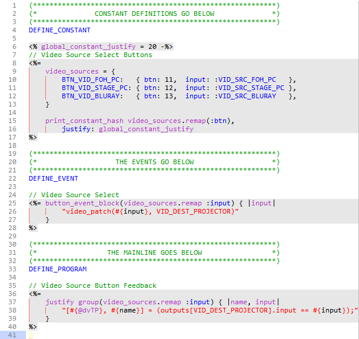
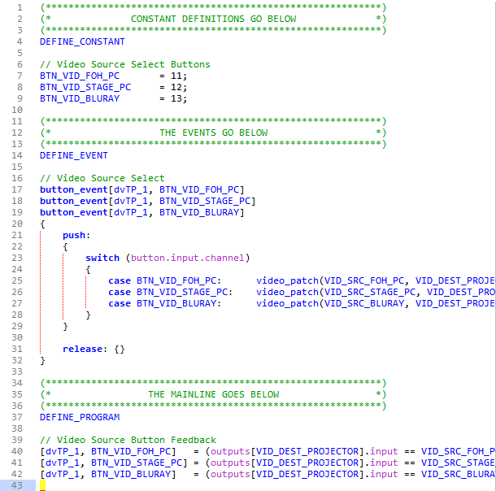
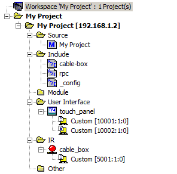

# NetLinx ERB

netlinx-erb

A code generation framework for AMX NetLinx control systems.

[](http://badge.fury.io/rb/netlinx-erb)
[](http://www.rubydoc.info/gems/netlinx-erb)
[](https://github.com/amclain/netlinx-erb/blob/master/license.txt)

Syntax highlighting is included in [sublime-netlinx](https://github.com/amclain/sublime-netlinx#sublime-text-amx-netlinx-plugin).


## Overview

Use a descriptive syntax...

[](https://github.com/amclain/netlinx-erb/blob/master/screenshots/example_erb.png)

To generate repetitive NetLinx code...

[](https://github.com/amclain/netlinx-erb/blob/master/screenshots/example_axi.png)

With netlinx-erb, configuration is separated from implementation. For example,
touch panel button numbers and video inputs (configuration) are separated from
the code that handles video patching when a button is pressed (implementation).
Under this paradigm, reconfiguration can happen quickly as project requirements
change. Since the implementation code is separated from these changes and code
generation is automated, there is less chance of inducing bugs into the system
when a change in configuration happens.

For example, in the code above, let's say the client decides to add a camera
to the system. All we have to do to update this file is add the following to
the `video_sources` hash:

```ruby
    BTN_VID_CAMERA: { btn: 14, input: :VID_SRC_CAMERA }
```

This defines a new touch panel button constant `BTN_VID_CAMERA`, assigns that
constant to channel number `14`, and adds a case to the button event handler
to switch the video matrix to `VID_SRC_CAMERA` when the button is pressed.
Since the implementation code for this change is auto-generated, and we know
that the implementation code works correctly, it is unlikely that this change
will create any bugs. There is a clear advantage to this method as the amount
of code grows and the project becomes more complex.

### RPC

A remote procedure call (RPC) mechanism is included to be able to call NetLinx
functions through ICSLan (NetLinx Diagnostics, Telnet, etc.). To issue an RPC
function call, `send_string` to `34500:1:0`. The body of the string should
start with the name of the function, followed by a space-separated list of
arguments.

For the following function:

```netlinx
define_function patch_video(integer input, integer output)
{
    // Patch video matrix.
}
```

`patch_video 1 2` is the RPC string that would patch video input 1 to output 2.

### Backward Compatibility

The NetLinx files generated by netlinx-erb are designed to be fully backward
compatible with traditional NetLinx project development, including readability
and adequate whitespace. This means that any NetLinx programmer can take over
maintenance of the project using the standard development tools provided by AMX
and does not need to have any experience with netlinx-erb.

It is important to note that ***this process is a one-way street***. Once the
generated files are modified by hand, the changes must be manually converted
back to the template files or else they will be erased the next time the
generator is run. Backward compatibility is designed for projects that are
permanently passed to other programmers who are not familiar with netlinx-erb
and are not able to learn it, like due to time constraints.


## Issues, Bugs, Feature Requests

Any bugs and feature requests should be reported on the GitHub issue tracker:

https://github.com/amclain/netlinx-erb/issues


**Pull requests are preferred via GitHub.**

Mercurial users can use [Hg-Git](http://hg-git.github.io/) to interact with
GitHub repositories.


## Installation

netlinx-erb is available as a Ruby gem.

1. Install [Ruby](https://www.ruby-lang.org) 2.1.5 or higher.
    * Windows: Use [RubyInstaller](http://rubyinstaller.org/downloads/)
        and make sure ruby/bin is in your [system path](http://www.computerhope.com/issues/ch000549.htm).
    * Linux: Use [rbenv](https://github.com/sstephenson/rbenv#basic-github-checkout).
    
2. Open the [command line](http://www.addictivetips.com/windows-tips/windows-7-elevated-command-prompt-in-context-menu/)
    and type:

    ***gem install netlinx-erb***


*NOTE: The NetLinx compiler executable provided by AMX, nlrc.exe, must be
installed on your computer for this utility to work. It is included in the
NetLinx Studio installation by default.*

**If you receive the following error when running gem install:**
```text
Unable to download data from https://rubygems.org/ - SSL_connect returned=1
```

Follow this guide:
[Workaround RubyGems' SSL errors on Ruby for Windows (RubyInstaller)](https://gist.github.com/luislavena/f064211759ee0f806c88)


## Prerequisites

netlinx-erb is a complex utility and does have a learning curve. However, the
time invested in learning this utility pays off in time saved from generating
code that would otherwise be handwritten, and troubleshooting fewer bugs. Due
to this, project maintenance also becomes easier.

### Programming Languages

Basic experience with the [Ruby programming language](https://www.ruby-lang.org)
is required, as well as [ERB templating](http://www.stuartellis.eu/articles/erb/).
The concept of [Model Oriented Programming (MOP)](http://download.imatix.com/mop/introduction.html)
is also used by this framework.

**Resources:**

* [Head First Ruby](http://shop.oreilly.com/product/9780596803995.do)
* [Design Patterns in Ruby](http://www.amazon.com/Design-Patterns-Ruby-Russ-Olsen/dp/0321490452/ref=sr_1_1?ie=UTF8&qid=1424904889&sr=8-1&keywords=ruby+design+patterns)
* [Practical Object-Oriented Design in Ruby](http://www.amazon.com/Practical-Object-Oriented-Design-Ruby-Addison-Wesley/dp/0321721330/ref=sr_1_2?ie=UTF8&qid=1424904889&sr=8-2&keywords=ruby+design+patterns)

### Development Tools

#### Text Editor

A good text editor is crucial for working with netlinx-erb. [Sublime Text 3](http://www.sublimetext.com/3)
with the [sublime-netlinx](https://github.com/amclain/sublime-netlinx#sublime-text-amx-netlinx-plugin)
plugin is recommended, as it provides syntax highlighting and code completion
for netlinx-erb.

>***Use a Single Editor Well***

>*The editor should be an extension of your hand; make sure your editor is
configurable, extensible, and programmable.*
-- [The Pragmatic Programmer](http://www.informit.com/store/pragmatic-programmer-from-journeyman-to-master-9780201616224)

#### Command Prompt

The command prompt is a powerful, flexible way to issue commands. Due to this,
many of the tools that netlinx-erb is built on use command line interfaces.

This guide will assume the reader is proficient with the command prompt.
SS64 is a great [command line reference](http://ss64.com/) if you need to look
up a command.


## Workflow

Developing a NetLinx project with netlinx-erb is significantly different than
with NetLinx Studio. Although netlinx-erb and NetLinx Studio are not strictly
mutually exclusive, trying to use NetLinx Studio to develop a netlinx-erb
project will create unnecessary friction.

There are three applications you will bounce between when developing a
netlinx-erb project:

* Text Editor
* Command Prompt
* Source Control Management System

At times you may need to open some of the standalone NetLinx tools like
NetLinx Diagnostics.

### Transitioning From NetLinx Studio

The big difference to understand coming from NetLinx Studio is that NetLinx
Studio is designed to be a monolithic, all-in-one application that contains
all of the features that you need. Or at least that's the theory. The problem
is that in reality NetLinx Studio only contains the features that AMX thinks
you need, and can't support features you want to add yourself.

What happens when you want to add code generation and automation to NetLinx
Studio to save time on repetitive tasks? Well, you can't.

netlinx-erb takes the opposite approach, building on many different components
that are smaller in scope. To the greatest extent possible, these components
are extendable, customizable, and cross-platform. This means you're able to
modify a netlinx-erb development environment to suit a particular project, or
your workflow in general.

Integrating with source control management (SCM) systems like [Mercurial](http://tortoisehg.bitbucket.org/)
and [Git](http://git-scm.com/) was also an important goal of netlinx-erb. Due
to this, most files are plain text and typically easy to read by a human. The
philosophy is that configuration should happen in your text editor, not a
proprietary GUI.


## Getting Started

### Creating A New Project

Open the command prompt in the directory used for your NetLinx projects and type:

```text
netlinx-erb -n my_project
```

Enter the `my_project` directory, which we'll reference as the project `root`
(or `/`). Take a minute to skim through the files that have been generated.

### Configuring The Workspace

`workspace.config.yaml`, referred to as the workspace configuration, is a text
file that replaces the functionality of a NetLinx Studio `.apw` workspace file.
Change this file to the following:

```yaml
systems:
  -
    name: My Project
    connection: 192.168.1.2 # (or your master)
    touch_panels:
      -
        path: touch_panel.TP4
        dps:
          - 10001:1:0
          - 10002:1:0
    ir:
      -
        path: cable_box.irl
        dps: 5001:1:0
```

* [YAML Workspace Configuration Reference](https://github.com/amclain/netlinx-workspace#yaml-workspace-configuration)

Now create `My Project.axs` and `include/cable-box.axi`. Using Sublime Text,
these files can be populated using the `NetLinx: New From Template: Overview`
and `NetLinx: New From Template: Include` commands, respectively. If you used
the templates, comment out the code for the [logger](https://github.com/amclain/amx-lib-log#amx-log-library)
for this example.

```netlinx
(***********************************************************)
(*                    INCLUDES GO BELOW                    *)
(***********************************************************)

// Comment this out for the example.
// #include 'amx-lib-log'

(***********************************************************)
(*                 STARTUP CODE GOES BELOW                 *)
(***********************************************************)
DEFINE_START

// Comment this out for the example.
// logSetLevel(LOG_LEVEL_DETAIL);
```

Also create `ir/cable_box.irl` and `touch_panel/touch_panel.TP4`. These files can
be empty, or the real thing. It doesn't matter for the example.

To get an idea of how the workspace config file relates to a traditional NetLinx
Studio workspace, run:

```text
rake generate_apw
```

Open `My Project.apw` in NetLinx Studio and take a look at the workspace tree.



The master source code, touch panel, and IR files show up in the tree, just like
we would expect. What you might not expect is that `cable-box` has shown up
under the `Include` folder even though it wasn't specified in the config.
This is a feature of [netlinx-workspace](https://github.com/amclain/netlinx-workspace#netlinx-workspace), 
which automatically consumes include files since there will probably be a lot of
them. Don't worry though, unwanted [files can be explicity excluded](https://github.com/amclain/netlinx-workspace/blob/6e99397b4fcfa6bd1cd6766008fd75e8dd5092c0/spec/workspace/yaml/single_system/workspace.config.yaml#L11-L13).

### Code Generation

*At this point it is important to have a working knowledge of Ruby and ERB. (See
[prerequisites](https://github.com/amclain/netlinx-erb#prerequisites).)*

In this example we'll connect touch panel buttons to the corresponding buttons
on the cable box remote control. To keep the code encapulated, we'll have
`include/cable-box.axi` model the cable box's remote control, and
`include/ui/template/panel.axi.erb.tmpl` will model the functions of the
identical touch panels.

* ["My Project" Reference Files](guides/getting_started/my_project)

First, create [include/cable-box.axi](guides/getting_started/my_project/include/cable-box.axi).
This file uses the traditional `.axi` extension because no code generation is
necessary. For a file this simple, code generation may actually create more work
and make the code harder to understand.

Next we'll configure the touch panels. Open `include/ui/_config.axi.erb`. This
is where we'll instruct the system to generate `.axi` files for each of the
touch panels:

```ruby
# Params - Converted into @tmpl_[key]
# First key (panel name) is available as @tmpl_suffix
touch_panels = {
    CONFERENCE_TABLE: { dps: 10001 },
    WALL:             { dps: 10002 },
}
```

The important thing to notice about this file is that values can be passed into
each touch panel's hash, which then become available in the template as instance
variables. By using the instance variable `@tmpl_dps` in the template, the value
`10001` will be written to `panel-conference-table.axi`, and `10002` will be
written to `panel-wall.axi`. We'll go over this more when creating the template
file.

* Note: [_config.axi.erb will be deprecated in v2.0](https://github.com/amclain/netlinx-erb/issues/1)

>**Why not use `DEFINE_COMBINE`?**

>Device combining concatenates all of the events into a single DPS, hiding which
touch panel actually sent the event. Conceptually, all of the physical touch
panels have to be thought of as one virtual touch panel -- they all mirror each
other. This means that touch panels that want to share the same code are forced
to share the same state as well.

>The answer to this problem is an advanced topic that will be covered in
another section. It is practical in situations like room combining where touch
panel B needs to operate autonomously when the rooms are separated, but needs to
mirror touch panel A when the rooms are combined (a state machine).

Since the touch panels share the same design file, `touch_panel.TP4`,
we'll use code generation to create the source code for each panel based on a
single template.

Create [include/ui/template/panel.axi.erb.tmpl](guides/getting_started/my_project/include/ui/template/panel.axi.erb.tmpl).
The first thing to notice is that unique names for the include guards can be
code generated:

```netlinx+erb
(***********************************************************
    Example Touch Panel
    
    For the netlinx-erb getting started project.
************************************************************)

#if_not_defined <%= "MY_PROJECT_TP_#{@tmpl_suffix}" %>
#define <%= "MY_PROJECT_TP_#{@tmpl_suffix}" %> 1
```

Let's apply this to assigning the DPS to each touch panel. Since a device
definition takes the form of `CONSTANT_NAME = DPS`, we can use code generation
to populate the constant name and device number for each file:

```netlinx+erb
(***********************************************************)
(*           DEVICE NUMBER DEFINITIONS GO BELOW            *)
(***********************************************************)
DEFINE_DEVICE

<%= "#{@dvTP} = #{@tmpl_dps}:1:0;" %>
```

When the `.axi` files are generated, `panel-conference-table.axi` will contain
`dvTP_CONFERENCE_TABLE = 10001:1:0;`, and `panel-wall.axi` will contain
`dvTP_WALL = 10002:1:0;`.

>When authoring an `erb` template it is important to think on a higher level of
abstration than you would with an `axi` file, keeping in mind that you're
writing code that writes code. Creating variations of a similar piece of code is
a perfect job for the code generator.

At this point we have a few different sets of data that need to be connected
together:

* Touch panel button numbers
* Named constants for those buttons
* The key on the cable box remote control that needs to be triggered when its
  corresponding touch panel button is pressed

These connections can be described in one place, making future changes simple:

```netlinx+erb
(***********************************************************)
(*              CONSTANT DEFINITIONS GO BELOW              *)
(***********************************************************)
DEFINE_CONSTANT

<%
    # Remember, this template generates multiple files.
    # Guard your global code to prevent include conflicts!
-%>
#if_not_defined MY_PROJECT_TP_CONSTANTS
#define MY_PROJECT_TP_CONSTANTS 1

<% global_constant_justify = 26 -%>
// Cable Box Buttons
<%=
    generate_constant_ivars cable_box_buttons = {
        # :btn - Touch panel button number.
        # :key - Cable box remote control key from `cable-box.axi`.
        BTN_CABLE_BOX_1: { btn: 101, key: :CABLE_BOX_KEY_1 },
        BTN_CABLE_BOX_2: { btn: 102, key: :CABLE_BOX_KEY_2 },
        BTN_CABLE_BOX_3: { btn: 103, key: :CABLE_BOX_KEY_3 },
        BTN_CABLE_BOX_4: { btn: 104, key: :CABLE_BOX_KEY_4 },
        BTN_CABLE_BOX_5: { btn: 105, key: :CABLE_BOX_KEY_5 },
        BTN_CABLE_BOX_6: { btn: 106, key: :CABLE_BOX_KEY_6 },
        BTN_CABLE_BOX_7: { btn: 107, key: :CABLE_BOX_KEY_7 },
        BTN_CABLE_BOX_8: { btn: 108, key: :CABLE_BOX_KEY_8 },
        BTN_CABLE_BOX_9: { btn: 109, key: :CABLE_BOX_KEY_9 },
        BTN_CABLE_BOX_0: { btn: 110, key: :CABLE_BOX_KEY_0 },
    }
    
    print_constant_hash cable_box_buttons.remap(:btn), justify: global_constant_justify
%>

#end_if
```

* [Helper Method API Reference](http://www.rubydoc.info/gems/netlinx-erb/NetLinx/ERB/Helpers)

Now it's time to add a button event handler to connect the touch panel button
to the cable box IR code:

```netlinx+erb
(***********************************************************)
(*                   THE EVENTS GO BELOW                   *)
(***********************************************************)
DEFINE_EVENT

// Cable Box Controls
<%=
    button_event_block(cable_box_buttons.remap(:key), momentary: true) { |key|
        "cable_box_key(#{key})"
    }
%>
```

Does this section of code look unusually short compared to its NetLinx
counterpart? Well there's a good reason for that: The code it writes is
incredibly repetitive and therefore a lot of work can be handed off to the
code generator. Even better, since this code references the `cable_box_buttons`
hash, every time a button is added or modified this section of generated code is
updated automatically.

```netlinx
// GENERATED FILE `panel-conference-table.axi`

(***********************************************************)
(*                   THE EVENTS GO BELOW                   *)
(***********************************************************)
DEFINE_EVENT

// Cable Box Controls
button_event[dvTP_CONFERENCE_TABLE, BTN_CABLE_BOX_1]
button_event[dvTP_CONFERENCE_TABLE, BTN_CABLE_BOX_2]
button_event[dvTP_CONFERENCE_TABLE, BTN_CABLE_BOX_3]
button_event[dvTP_CONFERENCE_TABLE, BTN_CABLE_BOX_4]
button_event[dvTP_CONFERENCE_TABLE, BTN_CABLE_BOX_5]
button_event[dvTP_CONFERENCE_TABLE, BTN_CABLE_BOX_6]
button_event[dvTP_CONFERENCE_TABLE, BTN_CABLE_BOX_7]
button_event[dvTP_CONFERENCE_TABLE, BTN_CABLE_BOX_8]
button_event[dvTP_CONFERENCE_TABLE, BTN_CABLE_BOX_9]
button_event[dvTP_CONFERENCE_TABLE, BTN_CABLE_BOX_0]
{
    push:
    {
        to[button.input];
        
        switch (button.input.channel)
        {
            case BTN_CABLE_BOX_1:    cable_box_key(CABLE_BOX_KEY_1);
            case BTN_CABLE_BOX_2:    cable_box_key(CABLE_BOX_KEY_2);
            case BTN_CABLE_BOX_3:    cable_box_key(CABLE_BOX_KEY_3);
            case BTN_CABLE_BOX_4:    cable_box_key(CABLE_BOX_KEY_4);
            case BTN_CABLE_BOX_5:    cable_box_key(CABLE_BOX_KEY_5);
            case BTN_CABLE_BOX_6:    cable_box_key(CABLE_BOX_KEY_6);
            case BTN_CABLE_BOX_7:    cable_box_key(CABLE_BOX_KEY_7);
            case BTN_CABLE_BOX_8:    cable_box_key(CABLE_BOX_KEY_8);
            case BTN_CABLE_BOX_9:    cable_box_key(CABLE_BOX_KEY_9);
            case BTN_CABLE_BOX_0:    cable_box_key(CABLE_BOX_KEY_0);
        }
    }
    
    release: {}
}
```

A remote control is a simple example of code generation in action. For a device
like a video matrix, imagine what happens when one of the inputs or outputs
needs to be repatched or renamed. All of the configuration information is in one
place; no need to find-and-replace throughout a file. This also helps to make
the code self-documenting, as all of the system configuration information is
grouped together.

```ruby
matrix_inputs = {
    VID_SRC_BLANK:          { input: 0,  name: "Blank" },
    VID_SRC_ROOM_1_PODIUM:  { input: 1,  name: "Podium 1" },
    VID_SRC_ROOM_1_WP:      { input: 2,  name: "Wall Panel 1" },
    VID_SRC_ROOM_2_PODIUM:  { input: 7,  name: "Podium 2" },
    VID_SRC_ROOM_2_WP:      { input: 4,  name: "Wall Panel 2" },
    VID_SRC_ROOM_3_PODIUM:  { input: 5,  name: "Podium 3" },
    VID_SRC_ROOM_3_WP:      { input: 6,  name: "Wall Panel 3" },
    VID_SRC_BLURAY:         { input: 9,  name: "Blu-Ray" },
    VID_SRC_CABLE:          { input: 10, name: "Cable TV" },
}
```

>**Separating Configuration From Implementation**

>netlinx-erb is designed to keep configuration and implementation code separated
as much as reasonably possible. This makes configuration changes fast and easy,
with significantly less risk that those changes will introduce bugs or break
the system.

Now that we have a touch panel template, open `My Project.axs` and add the
includes for `panel-conference-table` and `panel-wall`:

```netlinx
(***********************************************************)
(*                    INCLUDES GO BELOW                    *)
(***********************************************************)

// Comment this out for the example.
// #include 'amx-lib-log'

#include 'panel-conference-table'
#include 'panel-wall'
```

Also remember the include for `cable-box` in `panel.axi.erb.tmpl`:

```netlinx
(***********************************************************)
(*                    INCLUDES GO BELOW                    *)
(***********************************************************)

#include 'cable-box'
```
